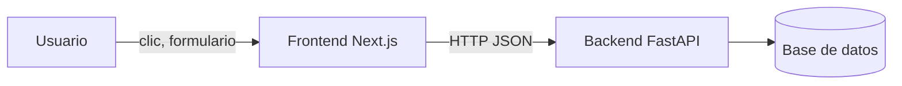

# ¿Qué es el frontend?

Material de estudio — Conceptos mínimos para entender la clase.

---

## Objetivos de aprendizaje

- Entender qué es una aplicación web y sus partes
- Conocer HTML, CSS y JavaScript en contexto
- Comprender qué es React y por qué lo usamos

---

## 1. Una aplicación web en 3 capas

Cuando abres una app en el navegador, intervienen tres tecnologías:

| Capa | Tecnología | Qué hace | Analogía |
|------|------------|----------|----------|
| **Estructura** | HTML | Define qué elementos hay (títulos, botones, tablas) | El esqueleto de una casa |
| **Estilo** | CSS | Define cómo se ve (colores, tamaños, espaciado) | La pintura y decoración |
| **Comportamiento** | JavaScript | Define qué pasa al interactuar (clics, validaciones) | La electricidad (interruptores) |

En nuestro proyecto, **Next.js + React** generan HTML/CSS/JS. **Tailwind** es nuestra forma de escribir CSS.

---

## 2. Frontend vs Backend



- **Frontend:** corre en el **navegador** del usuario (Chrome, Firefox). Es la interfaz.
- **Backend:** corre en un **servidor**. Guarda y procesa datos.

Nuestra app de productos es **frontend**. El API de FastAPI es **backend**.

---

## 3. ¿Qué es CRUD?

CRUD son las 4 operaciones básicas sobre datos:

| Letra | Operación | En español | En nuestra app |
|-------|-----------|------------|----------------|
| C | Create | Crear | Formulario "Nuevo producto" |
| R | Read | Leer | Tabla de productos |
| U | Update | Actualizar | Diálogo "Editar" |
| D | Delete | Eliminar | Diálogo "¿Eliminar?" |

---

## 4. ¿Qué es React?

**React** es una librería de JavaScript para construir interfaces con **componentes**.

Un componente es un bloque reutilizable de UI. Ejemplo:

```tsx
function Saludo({ nombre }: { nombre: string }) {
  return <h1>Hola, {nombre}</h1>;
}
```

Ventajas:

- **Reutilización:** un `ProductForm` sirve para crear y editar
- **Estado:** React actualiza la pantalla cuando cambian los datos
- **Composición:** piezas pequeñas forman interfaces complejas

---

## 5. ¿Qué es Next.js?

**Next.js** es un **framework** sobre React que añade:

- **Rutas por carpetas:** `app/products/page.tsx` → `/products`
- **Servidor integrado:** puede generar HTML en el servidor
- **Optimizaciones:** imágenes, fuentes, rendimiento

No necesitas saber React a fondo para esta clase. Construiremos paso a paso.

---

## 6. TypeScript (breve)

Usamos **TypeScript** = JavaScript + tipos.

```typescript
// JavaScript: cualquier valor
let price = "diez";  // error silencioso en runtime

// TypeScript: el editor avisa antes
let price: number = 10;
price = "diez";  // ❌ Error en el editor
```

En el proyecto, `Product` describe la forma exacta del JSON del API.

---

## 7. Cómo encaja todo en CTT Productos

```
HTML/CSS/JS  →  React (componentes)  →  Next.js (rutas + servidor)
                                              ↓
                                    Tailwind + shadcn (diseño)
                                              ↓
                                    Server Actions → FastAPI (datos)
```

---

## Preguntas de repaso

1. ¿Cuál es la diferencia entre frontend y backend?
2. ¿Qué significa cada letra de CRUD?
3. ¿Para qué sirve un componente en React?
4. ¿Por qué usamos TypeScript en lugar de JavaScript puro?

---

## Siguiente lectura

[Next.js App Router](02-nextjs-app-router.md)
