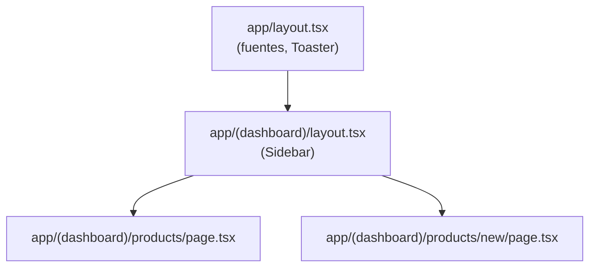

# Next.js App Router

Material de estudio — Rutas, layouts y tipos de componentes.

---

## Objetivos de aprendizaje

- Entender cómo Next.js mapea carpetas a URLs
- Diferenciar Server Components y Client Components
- Conocer archivos especiales: `layout.tsx`, `loading.tsx`, `page.tsx`

---

## 1. App Router — Rutas por carpetas

En Next.js 13+, la carpeta `app/` define las rutas:

```
app/
├── page.tsx              →  /
├── products/
│   ├── page.tsx          →  /products
│   ├── loading.tsx       →  (UI de carga automática)
│   └── new/
│       └── page.tsx      →  /products/new
└── (dashboard)/          →  grupo (NO afecta la URL)
    └── layout.tsx        →  layout compartido
```

**Regla:** cada carpeta con `page.tsx` es una ruta accesible.

---

## 2. Grupos de rutas `(nombre)`

Los paréntesis crean un **grupo** que organiza archivos sin cambiar la URL:

```
app/(dashboard)/products/page.tsx  →  /products  (no /dashboard/products)
```

Útil para compartir un layout (sidebar) entre varias páginas.

---

## 3. Layouts anidados

Un `layout.tsx` envuelve todas las páginas de su carpeta y subcarpetas:



En nuestro proyecto:

- [`app/layout.tsx`](../../app/layout.tsx) — fuente Open Sans, toasts
- [`app/(dashboard)/layout.tsx`](../../app/(dashboard)/layout.tsx) — sidebar + header

---

## 4. Server Components vs Client Components

| | Server Component | Client Component |
|---|------------------|------------------|
| **Directiva** | (ninguna, default) | `"use client"` al inicio |
| **Dónde corre** | Servidor | Navegador |
| **Puede usar** | async/await, fetch directo | useState, onClick, useEffect |
| **Ejemplo en proyecto** | `products/page.tsx` | `products-table.tsx` |

### ¿Cuándo usar cada uno?

- **Server:** leer datos, mostrar contenido estático o poco interactivo
- **Client:** formularios, botones, diálogos, cualquier interactividad

---

## 5. searchParams — Paginación en la URL

En Next.js 16, los query params llegan como **Promise**:

```typescript
// app/(dashboard)/products/page.tsx
type Props = {
  searchParams: Promise<{ page?: string; page_size?: string }>;
};

export default async function ProductsPage({ searchParams }: Props) {
  const params = await searchParams;
  const page = Number(params.page) || 1;
  // ...
}
```

URL: `/products?page=2&page_size=10`

Ventajas: enlace compartible, botón atrás del navegador funciona.

---

## 6. loading.tsx — Suspense automático

Si existe `loading.tsx` junto a `page.tsx`, Next.js lo muestra mientras la página carga:

```
app/(dashboard)/products/
├── page.tsx       ← tarda en cargar (fetch al API)
└── loading.tsx    ← se muestra mientras tanto (Skeletons)
```

Ver: [`app/(dashboard)/products/loading.tsx`](../../app/(dashboard)/products/loading.tsx)

---

## 7. redirect — Redirección de rutas

```typescript
import { redirect } from "next/navigation";

export default function HomePage() {
  redirect("/products");
}
```

[`app/(dashboard)/page.tsx`](../../app/(dashboard)/page.tsx) redirige `/` → `/products`.

---

## Preguntas de repaso

1. ¿Qué URL genera `app/products/new/page.tsx`?
2. ¿Para qué sirve un grupo de rutas `(dashboard)`?
3. ¿Cuándo necesitas `"use client"`?
4. ¿Por qué `searchParams` requiere `await` en Next.js 16?

---

## Siguiente lectura

[Tailwind y shadcn](03-tailwind-y-shadcn.md)
