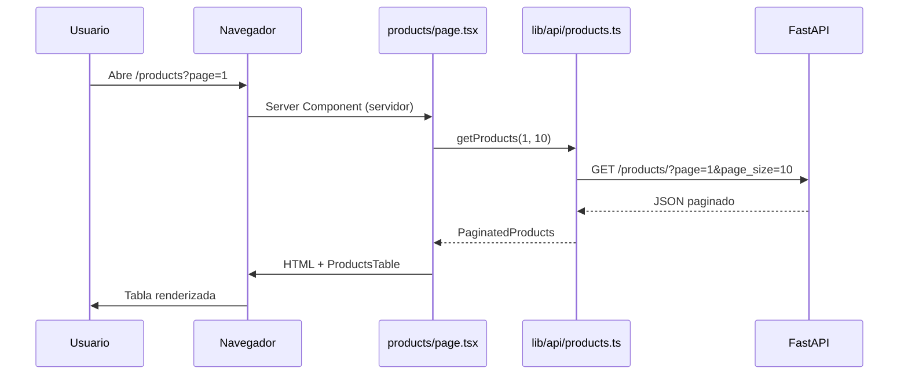
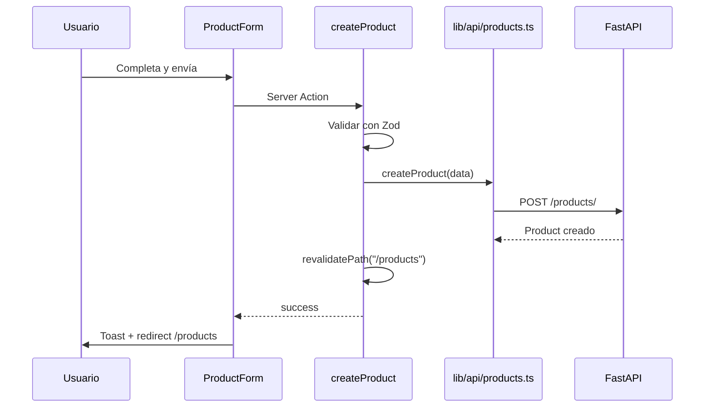

# Arquitectura del proyecto

Material de estudio — Mapa del repositorio y flujo de datos.

---

## Objetivos de aprendizaje

- Navegar la estructura de carpetas con confianza
- Entender el flujo de datos de punta a punta
- Saber qué archivo tocar para cada funcionalidad

---

## 1. Mapa de carpetas

| Carpeta / archivo | Para qué sirve | Analogía |
|-------------------|----------------|----------|
| `app/` | Páginas y rutas | Las habitaciones de la casa |
| `app/layout.tsx` | Layout global (fuente, toasts) | La estructura de la casa |
| `app/(dashboard)/` | Páginas con sidebar | Planta con cocina común |
| `components/` | Piezas reutilizables de UI | Muebles prefabricados |
| `components/ui/` | Componentes shadcn | Muebles de catálogo |
| `components/products/` | Lógica UI de productos | Muebles del dormitorio productos |
| `lib/types/` | Tipos TypeScript | Contrato del API |
| `lib/validations/` | Reglas Zod | Reglas del formulario |
| `lib/api/` | HTTP al backend | El mensajero |
| `actions/` | Server Actions | El cocinero (servidor) |

---

## 2. Estructura completa

```
app/
├── layout.tsx
├── globals.css
└── (dashboard)/
    ├── layout.tsx
    ├── page.tsx
    └── products/
        ├── page.tsx
        ├── loading.tsx
        └── new/page.tsx

actions/products.ts

components/
├── app-sidebar.tsx
├── ui/              (shadcn — no editar mucho)
└── products/
    ├── products-table.tsx
    ├── product-form.tsx
    ├── edit-product-dialog.tsx
    └── delete-product-dialog.tsx

lib/
├── utils.ts
├── types/product.ts
├── validations/product.ts
└── api/products.ts
```

---

## 3. Flujo de datos — Listar productos



Archivos involucrados:

- [`app/(dashboard)/products/page.tsx`](../../app/(dashboard)/products/page.tsx)
- [`lib/api/products.ts`](../../lib/api/products.ts) → `getProducts()`
- [`components/products/products-table.tsx`](../../components/products/products-table.tsx)

---

## 4. Flujo de datos — Crear producto



Archivos:

- [`app/(dashboard)/products/new/page.tsx`](../../app/(dashboard)/products/new/page.tsx)
- [`components/products/product-form.tsx`](../../components/products/product-form.tsx)
- [`actions/products.ts`](../../actions/products.ts) → `createProduct()`

---

## 5. Flujo de datos — Editar producto

1. Clic "Editar" → `editId` en `products-table.tsx`
2. `EditProductDialog` abre → `getProductById(id)` (GET)
3. Skeleton → formulario precargado
4. Guardar → `updateProduct(id, data)` (PUT)
5. `revalidatePath` → tabla actualizada

Archivos:

- [`components/products/edit-product-dialog.tsx`](../../components/products/edit-product-dialog.tsx)
- [`actions/products.ts`](../../actions/products.ts) → `getProductById()`, `updateProduct()`

---

## 6. ¿Qué archivo modifico si...?

| Quiero... | Archivo |
|-----------|---------|
| Cambiar columnas de la tabla | `components/products/products-table.tsx` |
| Cambiar campos del formulario | `components/products/product-form.tsx` |
| Cambiar validación | `lib/validations/product.ts` |
| Cambiar URL del API | `.env.local` + `lib/api/products.ts` |
| Agregar ítem al menú | `components/app-sidebar.tsx` |
| Cambiar colores del tema | `app/globals.css` |
| Cambiar paginación default | `app/(dashboard)/products/page.tsx` |

---

## 7. Capas de abstracción

```
UI (components/)
    ↓ llama
Server Actions (actions/)
    ↓ llama
API client (lib/api/)
    ↓ fetch
FastAPI backend
```

**Nunca** llames `lib/api/` directamente desde Client Components. Usa Server Actions.

---

## Preguntas de repaso

1. ¿Qué archivo define la ruta `/products`?
2. ¿Dónde vive la lógica HTTP hacia FastAPI?
3. ¿Por qué el formulario no llama a `lib/api` directamente?
4. ¿Qué hace `revalidatePath('/products')`?

---

## Siguiente lectura

[CRUD y Server Actions](05-crud-y-server-actions.md)
