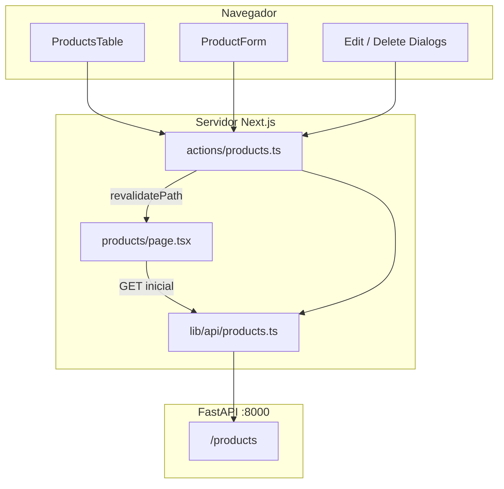

# Guion de clase — CTT Productos (Frontend CRUD)

**Duración total:** ~4 horas (incluye 15 min de descanso)  
**Modalidad:** Code-along en vivo  
**Audiencia:** Sin experiencia previa en Next.js ni frontend

---

## Objetivos de la sesión

Al terminar, los estudiantes podrán:

1. Explicar qué es frontend, backend y CRUD
2. Crear un proyecto Next.js con App Router
3. Conectar un frontend a un API FastAPI usando Server Actions
4. Construir una interfaz con shadcn/ui y Tailwind CSS
5. Implementar listado, creación, edición y eliminación de productos

---

## Agenda minuto a minuto

| Hora | Bloque | Duración | Acción del profesor |
|------|--------|----------|---------------------|
| 0:00 | **1. Contexto** | 25 min | Demo del proyecto final + conceptos web |
| 0:25 | **2. Scaffold** | 20 min | create-next-app + npm run dev |
| 0:45 | **3. UI base** | 25 min | shadcn init + Tailwind + Open Sans |
| 1:10 | **4. Capa de datos** | 35 min | types, api, actions |
| 1:45 | ☕ **Descanso** | 15 min | — |
| 2:00 | **5. Layout + Sidebar** | 30 min | (dashboard) layout + app-sidebar |
| 2:30 | **6. Listado + Tabla** | 40 min | products/page + products-table |
| 3:10 | **7. CRUD UI** | 50 min | formulario + diálogos |
| 4:00 | **Cierre** | 10 min | Repaso + ejercicios post-clase |

---

## Bloque 1: Contexto (25 min)

### Qué hacer

1. Mostrar la app final en `http://localhost:3000/products` (5 min)
2. Recorrer: sidebar, tabla, paginación, crear, editar, eliminar
3. Explicar conceptos con [01-que-es-el-frontend.md](../estudiantes/01-que-es-el-frontend.md)

### Frases guía

> "El **frontend** es todo lo que el usuario ve y toca: botones, tablas, formularios. El **backend** (FastAPI) guarda los datos en la base de datos. Nosotros construiremos el frontend; el backend ya existe."

> "**CRUD** son las 4 operaciones básicas: **C**reate (crear), **R**ead (leer), **U**pdate (actualizar), **D**elete (eliminar)."

> "Cuando haces clic en 'Productos', el navegador pide datos al servidor. Eso es una petición **HTTP GET**. Crear un producto es **POST**, editar es **PUT**, eliminar es **DELETE**."

### Checkpoint

- [ ] Estudiantes entienden frontend vs backend
- [ ] Estudiantes pueden nombrar las 4 operaciones CRUD

---

## Bloque 2: Scaffold (20 min)

### Qué hacer

Seguir [01-scaffold-y-setup.md](../code-along/01-scaffold-y-setup.md)

### Frases guía

> "Next.js organiza las páginas en la carpeta `app/`. Cada carpeta es una ruta: `app/products/page.tsx` → `/products`."

> "`npm run dev` levanta un servidor de desarrollo en el puerto 3000. Cada vez que guardas un archivo, la página se actualiza sola."

### Checkpoint

- [ ] Todos tienen `npm run dev` corriendo
- [ ] Todos ven la página de bienvenida de Next.js en localhost:3000

---

## Bloque 3: UI base (25 min)

### Qué hacer

Seguir [02-shadcn-y-tailwind.md](../code-along/02-shadcn-y-tailwind.md)

### Frases guía

> "**Tailwind** son clases de utilidad: `flex`, `gap-4`, `p-4`. En lugar de escribir CSS en un archivo aparte, pones las clases directo en el HTML/JSX."

> "**shadcn/ui** no es una librería que instalas con npm. Copia el código de los componentes a tu proyecto. Tú los controlas."

> "Los **tokens semánticos** como `bg-background` o `text-primary` evitan hardcodear colores. Si cambias el tema, todo se actualiza."

### Checkpoint

- [ ] `npx shadcn@latest init --defaults` completado
- [ ] `.env.example` y `.env.local` creados
- [ ] Open Sans configurada en `app/layout.tsx`

---

## Bloque 4: Capa de datos (35 min)

### Qué hacer

Seguir [03-capas-de-datos.md](../code-along/03-capas-de-datos.md)

### Frases guía

> "**TypeScript types** describen la forma de los datos. Si el API devuelve `{ name, price, id }`, nuestro type `Product` lo refleja."

> "**Server Actions** son funciones que corren en el servidor. El navegador nunca ve la URL del API. No hay problemas de CORS."

> "Validamos con **Zod** dos veces: en el formulario (feedback rápido) y en el servidor (seguridad)."

### Checkpoint

- [ ] Backend FastAPI corriendo en `:8000`
- [ ] `lib/api/products.ts` con `getProducts` funciona (probar en consola o page temporal)
- [ ] `actions/products.ts` exporta las 5 acciones

---

## ☕ Descanso (15 min)

---

## Bloque 5: Layout + Sidebar (30 min)

### Qué hacer

Seguir [04-layout-y-sidebar.md](../code-along/04-layout-y-sidebar.md)

### Frases guía

> "Los paréntesis en `(dashboard)` crean un **grupo de rutas**. Organizan archivos sin cambiar la URL."

> "Un **layout** envuelve varias páginas. El sidebar aparece en todas las rutas del dashboard sin repetir código."

> "`usePathname()` nos dice en qué ruta estamos para resaltar el ítem activo del menú."

### Checkpoint

- [ ] Sidebar visible con enlaces Productos y Crear producto
- [ ] `/` redirige a `/products`
- [ ] Layout con header y área de contenido funciona

---

## Bloque 6: Listado + Tabla (40 min)

### Qué hacer

Seguir [05-listado-y-tabla.md](../code-along/05-listado-y-tabla.md)

### Frases guía

> "Un **Server Component** se ejecuta en el servidor. Puede hacer `fetch` directamente sin exponer secretos al navegador."

> "En Next.js 16, `searchParams` es una **Promise**. Hay que hacer `await searchParams` antes de leer `page`."

> "La paginación vive en la **URL**: `/products?page=2`. Así puedes compartir el enlace o usar el botón atrás del navegador."

### Checkpoint

- [ ] Tabla muestra productos del API
- [ ] Paginación Anterior/Siguiente funciona
- [ ] Badge verde "Activo" visible

---

## Bloque 7: CRUD UI (50 min)

### Qué hacer

Seguir [06-crear-producto.md](../code-along/06-crear-producto.md) y [07-editar-y-eliminar.md](../code-along/07-editar-y-eliminar.md)

### Frases guía

> "Un **Client Component** (`'use client'`) puede usar estado, eventos y hooks. Los formularios siempre son Client Components."

> "El diálogo de edición hace un **GET al abrir** para tener datos frescos del servidor, no los de la tabla."

> "`revalidatePath('/products')` le dice a Next.js: 'regenera esa página con datos nuevos' después de crear, editar o eliminar."

### Checkpoint

- [ ] Crear producto en `/products/new` funciona
- [ ] Editar abre diálogo, muestra skeleton, precarga datos
- [ ] Eliminar pide confirmación y borra el registro
- [ ] Toasts de éxito/error aparecen

---

## Cierre (10 min)

1. Mostrar diagrama de arquitectura ([04-arquitectura-del-proyecto.md](../estudiantes/04-arquitectura-del-proyecto.md))
2. Repasar flujo: URL → Server Component → API → UI
3. Asignar [ejercicios post-clase](../ejercicios/ejercicios-post-clase.md)
4. Q&A

---

## Plan B — Si van atrasados

| Prioridad | Qué conservar | Qué acortar/omitir |
|-----------|---------------|-------------------|
| Alta | Listado + crear producto | — |
| Media | Editar con diálogo | Precarga GET: usar datos de la tabla directamente |
| Baja | Eliminar con AlertDialog | Dejar como ejercicio post-clase |
| Opcional | Paginación | Mostrar solo página 1 |

**Atajo Bloque 2:** Si hay branch `starter`, partir de ahí en lugar de `create-next-app` en vivo (ahorra ~10 min).

**Atajo Bloque 7:** Copiar `product-form.tsx` y páginas desde el repo final; explicar en lugar de tipear todo.

---

## Diagrama de arquitectura (para pizarra o slide)

---

## Material de apoyo durante la clase

| Momento | Documento |
|---------|-----------|
| Explicar conceptos | [estudiantes/](../estudiantes/) |
| Code-along paso a paso | [code-along/](../code-along/) |
| Mini-retos | [ejercicios-en-clase.md](../ejercicios/ejercicios-en-clase.md) |
| Errores en vivo | [02-preguntas-frecuentes.md](02-preguntas-frecuentes.md) |
